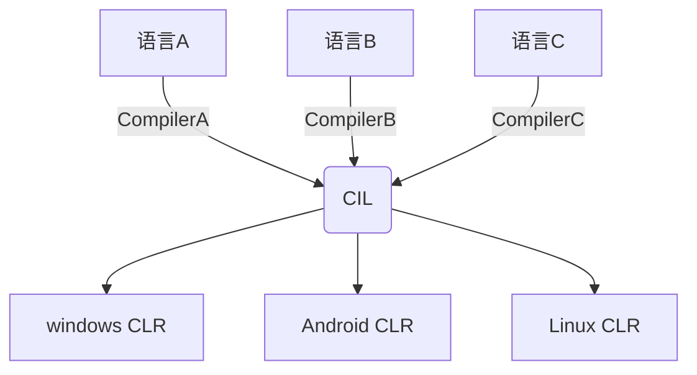

## 从.Net Framework谈到Mono
### .Net Framework
&emsp;由于本文的目的是探索mono与unity的关系，所以.net Framework部分的整理会相对简单一些，主要目的是为理解mono做一个铺垫。
&emsp; .net Framework简单来说是微软推出的一个跨平台基础（只有windows实现）框架, c#则是运行在该框架下的编程语言。
&emsp;为什么说它是一个跨平台的框架呢？原因在于它是基于通用语言基础架构(**Common Language Infrastructure**, 简称**CLI**)实现的。
&emsp;CLI的提出旨在统一不同的高级开发语言在不同平台直接执行方式的差异。 按照CLI的规定，用来描述可执行代码的是一种叫做**CIL**（**Common Intermediate Language**）的语言，这是一种介于高级语言和机器语言之间的中间语言。
 &emsp; 不同语言统一成CIL后，通过不同平台**CLR**(**Common Language Runtime**)翻译器机器指令，从而实现大一统。
<!-- more -->  

&emsp;回过头来.net Framework框架包括什么呢？
* 高级编程语言,比如c#,jscript,j#,VB
* 公共语言规范（CLS）和公共类型系统（CTS）
* 提供高级编程语言使用的各种类库(Framework Class Library)FCL和(Base Class Library)BCL
* Compiler高级编程语言编译器（高级编程语言->CIL）
* CLR（Common Language Runtime） IL语言的运行时
### Mono
&emsp;Mono是基于.net framework框架下的夸平台的实现。以下是Mono官网的介绍。
>Sponsored by Microsoft, Mono is an open source implementation of Microsoft's .NET Framework based on the ECMA standards for C# and the Common Language Runtime. A growing family of solutions and an active and enthusiastic contributing community is helping position Mono to become the leading choice for development of cross platform applications.

&emsp;从官网进入一个mono release版本的说明我们可以发现主要包括以下内容：
* Runtime interpreter(CLR)
* Class Libraries(.net framework各种类库）
* c# compiler
## 谈谈c#编译器
### .net c# compiler
&emsp;.c#编译器的作用是把c#翻译成CIL这种中间语言，随便c#的更新迭代，.net famework的c#编译器（**csc.exe**，如果你安装的.net Framework能在Microsoft.Net文件夹中找到）也经历了很长的一段时间进化。
* csc.exe 1.0 .Net Framework 1.0 实现了c# 1.0特性
* csc.exe 2.0 .Net Framework 2.0 实现了c# 2.0特性
* csc.exe 3.5 .Net Framework 3.5 实现了c# 3.0特性
* csc.exe 4.x .Net Framework (4.5~4.7) 实现了c# 5.0特性
**注意以上各版本c#编译器都是都是使用c++实现的**
&emsp;随着.net Framework的发展微软实现了c#编译器的自举（[bootstrapping](en.wikipedia.org/wiki/Bootstrapping_(compilers)))，即c#编译器使用c#实现，该编译器被命名为**Roslyn**。自从Visaul Studio 2015开始，就开始用Roslyn编译器作为默认的c#编译器。
* Roslyn csc.exe 1.x 实现了c# 6.0特性（VS2015）
* Roslyn csc.exe 2.x 实现了c# 7.x特性 ( VS2017及以上）
### mono c# compiler
&emsp;Common Langauge Infrastructure是一个开发的技术规范，也就是说只要只要能生成出满足规范的CIL中间语言，大家都可以实现各自的c#编译器。mono就实现了自己的[c#编译器](mono-project.com/docs/about-mono/languages/csharp/)。
* gmcs:对应微软基础类库（mscorlib 2.0)，csc.exe2.0-3.5
* smcs:对应微软基础类库（mscorlib 2.1),主要用于基于Unix的操作系统
* dmcs:对应微软基础类库（mscorlib 4.0), csc.exe 4.x
* mcs:从mono2.11开始,出现的编译器，用于代替之前的gmcs和dmcs,并且实现了全部c#1-6和部分c#7的特性

## CLR-公共语言运行时
&emsp;.net Framework和mono都有各自的CLR。
&emsp;mono的CLR名字就叫mono，从unity editor文件夹中能够找到mono.exe，它就是mono的CLR。
&emsp;.net Framework的CLR不是一个可执行程序.exe，它只是以普通的dll文件存在，至于它是如何调用执行的，暂时先不做探究，后续有时间再去研究研究。微软提供了一个查看CLR版本的工具（Clrver.exe），可以查看目前运行程序对应的CLR版本。

## 从Unity Editor中找到mono
&emsp;既然大家都说unity的c#脚本是运行在mono上，自然我们需要去unity editor里面去找找c#的编译器，CLR以及类库来验证以上说法，也帮助自己更深入的理解上述那句话的含义。先申明一下，我使用的Unity版本是2018.3.6f1。
 &emsp;打开安装目录进入Editor/Data后，我们可以看到有两个文件夹一个是Mono,另外一个是MonoBleedingEdge。
 
 &emsp;为什么存在两个mono的文件夹呢？以下是Unity-Technologies官方给出的解释:
 >Each Unity release contains two versions of Mono. One older version (Mono) is embedded into the Editor and Players. Another newer version (MonoBleedingEdge) is used to run tools and tests.
 
 ok现在我们可以只有Mono对应的是老版本，而MonoBleedingEdge对应的则是新版本。
 &emsp;**首先我们先来看看Mono文件夹，看看老版本Mono的内容**。
 &emsp;进入Mono/bin，我们发现了mono.exe，即mono的CLR。 还有大量的.bat（批处理）文件，其中发现了几个很眼熟的命名gmcs/smcs，打开.bat文件发现它指向的其实就是对于的.exe文件。这不就是之前提到过的c#的编译器吗？为什么没有dmcs/msc，估计是老版本的原因吧。接着我查看了mono CLR的版本为2.0，

 根据bat文件中的目录找到对应的gmcs，发现确实是c#编译器对应的版本为2.6.5.0

 &emsp;**接着我们进入MonoBleedingEdge文件夹，看看新版本Mono的内容**
 &emsp;和之前的思路一样，进入bin文件夹，依然发现mono.exe，而这次只找到了mcs.bat文件。正如mono官方解释他们在mono 2.11开始就使用了mcs来代替之前的gmcs编译器。新版本mono CLR对应的版本为5.11.0,

 新版本mono对应的c#编译器mcs的版本也为5.11.0

 &emsp;到这里基本上对unity与mono的关系有了一个大概完整的认识。**那么在unity Editor上c#代码就一定是由mono c# compiler再到mono JIT(CLR)这样一个运行过程吗？既然都是相同的CIL,为什么不可以使用微软的开源的Roslyn编译器呢**？这个问题在unity官方手册中找到了答案：

 随着.Net版本设置不同，unity会选择不同的c#编译器。那么问题来了，Roslyn对应的可执行程序csc.exe放在哪个位置的呢？进入Editor/Data/Tools/Roslyn中可以找打答案：

 &emsp;以上就是本文全部内容,希望对大家有所帮助吧!
